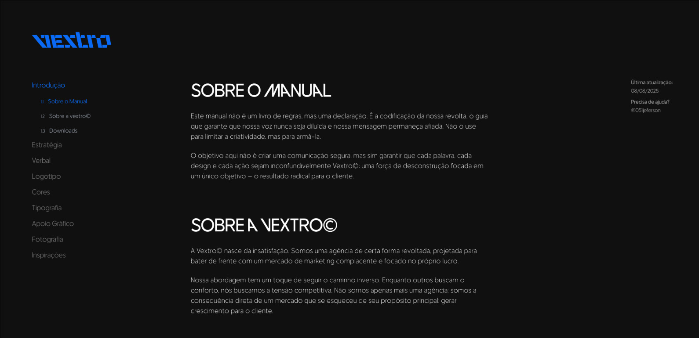
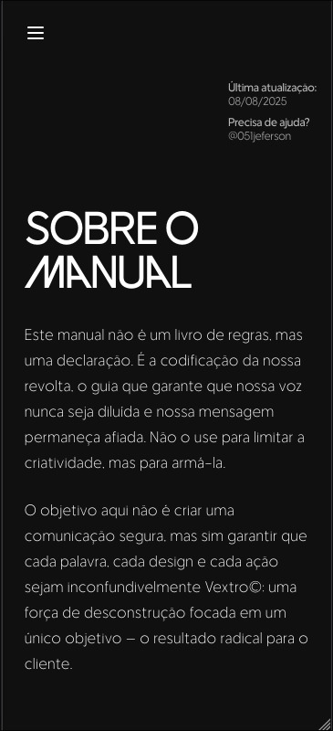

<div align="center">

# 🚀 Vextro Manual Digital

**Manual de identidade visual interativo da agência Vextro© com navegação fluida e animações avançadas**


[](LICENSE)
[](https://reactjs.org/)
[](https://www.typescriptlang.org/)
[](https://vitejs.dev/)
[](https://tailwindcss.com/)

</div>

---

## 📸 Preview

<div align="center">


<p><em>Visualização desktop com layout responsivo e tema escuro</em></p>


<p><em>Interface mobile otimizada com navegação intuitiva</em></p>

</div>

---

## ✨ Funcionalidades

### 🎯 Principais Características

- **🎨 Interface Interativa** - Manual de identidade visual com navegação fluida e intuitiva
- **⚡ Animações Avançadas** - Sistema de animações customizadas com TailwindCSS
- **📱 Design Responsivo** - Otimizado para desktop, tablet e mobile
- **🎭 Sistema de Componentes** - Biblioteca de componentes UI reutilizáveis
- **🧭 Navegação Inteligente** - Sidebar com scroll automático e detecção de seções
- **🎨 Tipografia Customizada** - Fontes exclusivas com features avançadas (ligatures, stylistic sets)
- **🎯 Intersection Observer** - Detecção automática de scroll para animações
- **⚙️ TypeScript Strict** - Código totalmente tipado e organizado

### 🛠️ Funcionalidades Técnicas

- **🏗️ Arquitetura Modular** - Estrutura escalável com separação de responsabilidades
- **🎨 Sistema de Design** - Componentes UI padronizados com variantes de cor
- **📊 Performance Otimizada** - Lazy loading e memoização para melhor performance
- **🔧 Hot Module Replacement** - Desenvolvimento rápido com Vite
- **📝 JSDoc Completo** - Documentação em português brasileiro
- **🎯 Custom Hooks** - Hooks reutilizáveis para animações e navegação

---

## 🏗️ Arquitetura do Projeto

```
src/
├── 📁 components/          # Componentes reutilizáveis
│   └── AnimatedSection.tsx
├── 📁 data/               # Dados estáticos e configurações
│   └── menuItems.ts
├── 📁 hooks/              # Custom hooks
│   ├── useScrollAnimation.ts
│   └── useSectionNavigation.ts
├── 📁 layouts/            # Layouts da aplicação
│   ├── MainLayout.tsx
│   └── Sidebar/
├── 📁 pages/              # Páginas principais
│   └── Home.tsx
├── 📁 routes/             # Configuração de rotas
├── 📁 sections/           # Seções do manual organizadas por categoria
│   ├── 1/ (Introdução)
│   ├── 2/ (Estratégia)
│   ├── 3/ (Verbal)
│   ├── 4/ (Logotipo)
│   ├── 5/ (Cores)
│   ├── 6/ (Tipografia)
│   ├── 7/ (Apoio Gráfico)
│   ├── 8/ (Fotografia)
│   └── 9/ (Inspirações)
├── 📁 styles/             # Estilos globais e fontes
├── 📁 types/              # Definições de tipos TypeScript
└── 📁 ui/                 # Componentes de interface
```

---

## 📄 Páginas e Seções

### 🎯 Introdução

- **Sobre o Manual** - Apresentação e propósito do manual
- **Sobre a vextro©** - História e filosofia da agência
- **Downloads** - Recursos disponíveis para download

### 🎯 Estratégia

- **Filosofia** - Princípios fundamentais da marca
- **Inimigo** - Posicionamento competitivo
- **Valores** - Pilares da agência
- **Desvalores** - O que a marca rejeita

### 🎯 Verbal

- **Personalidade** - Tom de voz e características
- **Vocabulário** - Palavras-chave e expressões
- **Exemplos** - Aplicações práticas da comunicação
- **Personalidade** - Diretrizes de personalidade da marca

### 🎯 Logotipo

- **Introdução** - Apresentação da marca principal
- **Variações** - Diferentes versões do logo
- **Margem de Segurança** - Regras de uso e espaçamento

### 🎯 Cores

- **Introdução** - Significado e aplicação das cores
- **Paleta de Cores** - Paleta oficial da marca

### 🎯 Tipografia

- **Introdução** - Fonte principal da marca
- **Tipografia Institucional** - Fontes complementares
- **Aplicação** - Diretrizes de aplicação

### 🎯 Apoio Gráfico

- **Elementos Gráficos** - Visualizações e infográficos

### 🎯 Fotografia

- **Fotografia** - Diretrizes para fotografia
- **Prompt** - Prompts para IA e automação
- **Referências** - Aplicações práticas

### 🎯 Inspirações

- **Referências** - Influências e inspirações da marca

---

## 🛠️ Tecnologias Utilizadas

### Frontend

- **React 19.1.0** - Biblioteca para interfaces de usuário
- **TypeScript 5.8.3** - Superset tipado do JavaScript
- **Vite 6.3.5** - Build tool e bundler moderno
- **TailwindCSS 3.4.0** - Framework CSS utility-first
- **React Router DOM 7.6.2** - Roteamento para aplicações React
- **Lucide React 0.525.0** - Biblioteca de ícones SVG

### Ferramentas de Desenvolvimento

- **ESLint 9.29.0** - Linter para qualidade de código
- **Prettier 3.5.3** - Formatador de código
- **PostCSS 8.4.35** - Processador CSS
- **Autoprefixer 10.4.17** - Prefixos CSS automáticos
- **Vite Image Tools 7.1.0** - Otimização de imagens

### Integrações

- **Intersection Observer API** - Detecção de scroll e visibilidade
- **CSS Custom Properties** - Variáveis CSS dinâmicas
- **Font Feature Settings** - Recursos avançados de tipografia

---

## 🚀 Como Executar

### Pré-requisitos

- Node.js 18+ 
- npm ou yarn
- Git

### Instalação

```bash
# Clone o repositório
git clone https://github.com/DionathaGoulart/vextro-manual.git

# Entre no diretório
cd vextro-manual

# Instale as dependências
npm install

# Execute em modo desenvolvimento
npm run dev
```

### Scripts Disponíveis

```bash
# Desenvolvimento
npm run dev          # Inicia servidor de desenvolvimento
npm run build        # Build para produção
npm run preview      # Preview do build de produção

# Qualidade de Código
npm run lint         # Executa ESLint
```

---

## 🔧 Configuração

### Variáveis de Ambiente

Crie um arquivo `.env.local` na raiz do projeto:

```env
# Desenvolvimento
VITE_APP_TITLE=Vextro Manual
VITE_APP_VERSION=1.0.0

# Analytics (opcional)
VITE_GA_ID=your-google-analytics-id
```

### Personalização

- **Cores**: Edite `tailwind.config.js`
- **Fontes**: Configure em `src/styles/fonts.css`
- **Animações**: Modifique os keyframes em `tailwind.config.js`
- **Componentes**: Adicione novos em `src/ui/`
- **Seções**: Configure em `src/sections/`

---

## 📱 Responsividade

O manual é totalmente responsivo e otimizado para:

- **📱 Mobile** (320px - 768px)
- **📱 Tablet** (768px - 1024px)
- **💻 Desktop** (1024px - 1440px)
- **🖥️ Large Desktop** (1440px+)

---

## 📄 Licença

**⚠️ ATENÇÃO: Este projeto é de uso exclusivo e pessoal.**

### Direitos Reservados

Este software e sua documentação são propriedade exclusiva do autor e estão protegidos por direitos autorais. É **expressamente proibido**:

- ❌ **Copiar** o código fonte
- ❌ **Modificar** sem autorização
- ❌ **Distribuir** o software
- ❌ **Usar** para fins comerciais
- ❌ **Criar trabalhos derivados**
- ❌ **Fazer engenharia reversa**

### Uso Permitido

- ✅ **Visualizar** o código para fins educacionais
- ✅ **Estudar** a implementação para aprendizado
- ✅ **Inspirar-se** nas ideias e conceitos
- ✅ **Fazer fork** apenas para estudo pessoal

### Consequências

A violação desta licença resultará em:

- Ação legal imediata
- Remoção do conteúdo infrator
- Danos e prejuízos conforme a lei

**© 2025 Dionatha Goulart. Todos os direitos reservados.**

---

## 📞 Contato

**Desenvolvedor**: Dionatha Goulart  
**Email**: dionatha.work@gmail.com  
**Portfolio**: https://dionatha.com.br/  
**GitHub**: https://github.com/DionathaGoulart  
**Linkedin**: https://www.linkedin.com/in/dionathagoulart/

---

<div align="center">

**Feito by Dionatha Goulart**

</div>
