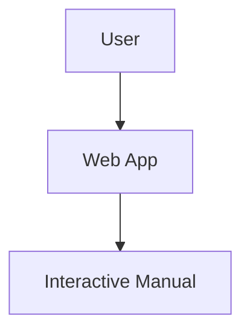

<div align="center">

# VEXTRO BRAND MANUAL
### INTERACTIVE DOCUMENTATION


<br />

**Interactive brand manual for Vextro© agency.**
**Features fluid navigation, advanced animations, and custom typography.**

[Getting Started](#-getting-started) • [License](#-license)

</div>

---

## 🏗️ Architecture

A specialized frontend application built with **React** and **Vite** for high performance and smooth animations.


```mermaid
graph TD;
    User-->App[Web App];
    App-->Content[Interactive Manual];
```

---

## 🚀 Features

<div align="center">

| Feature | Description |
|:-------:|:----------- |
| **Interactive Navigation** | sidebar with auto-scroll and section detection. |
| **Animations** | Advanced custom animations using Intersection Observer. |
| **Typography** | Custom font implementation with ligatures and stylistic sets. |

</div>

---

## 🛠️ Getting Started

### Prerequisites

*   **Node.js 18+**

### Installation

```bash
# 1. Clone the repository
git clone https://github.com/DionathaGoulart/Manual.git

# 2. Enter the directory
cd Manual/Vextro

# 3. Install dependencies
npm install
npm run dev
```

---

## 📄 License

This project is proprietary and confidential.

**Copyright © 2026 Dionatha Goulart.**
All Rights Reserved.
